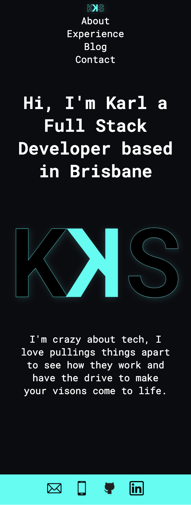
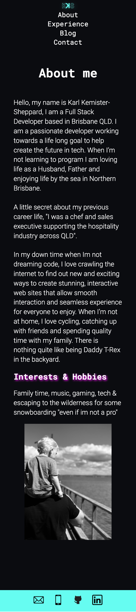
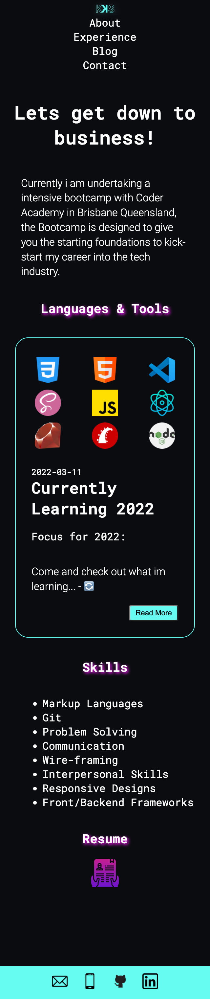
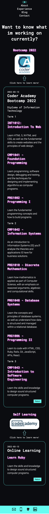
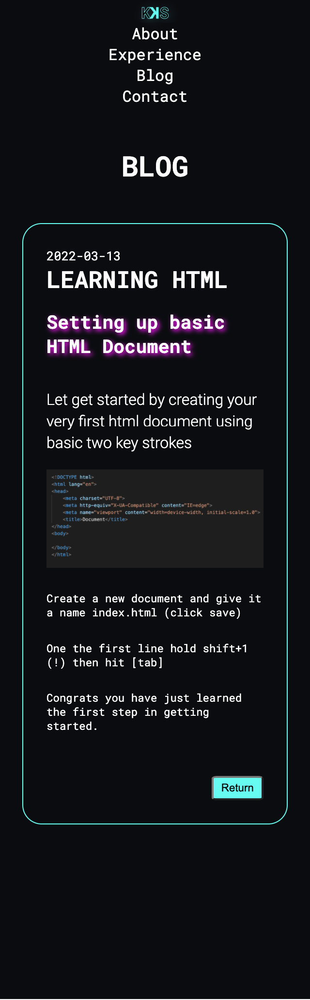
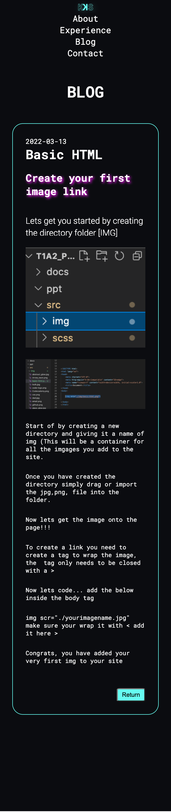
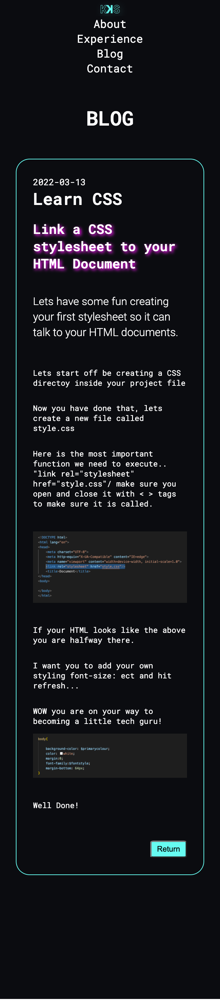
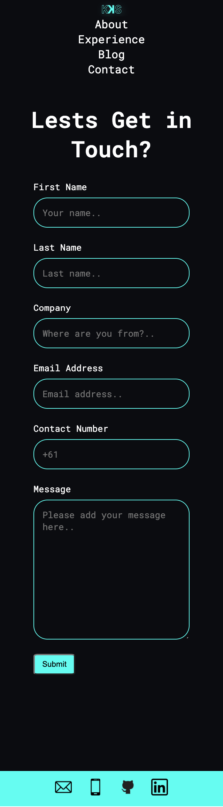

# A link (URL) to your published portfolio website:
[https://kks.netlify.app/index.html]
# A link to your GitHub repo
[https://github.com/karlkemistersheppard/portfolio]

# Description of your portfolio website:

### <u>**Purpose**</u>
The purpose of this project was to create an online portfolio that allows potential employers and recruiters to see where my current skills are and what I am working on to further my learning in various programming languages.  It also showcases my understanding and design process from the start to finish from mockup stage /wireframes to pushing modifications/ amendments via git functions in the terminal.

### <u>**Functionality**</u>
The website was created with one purpose when the project was in the design stage (KISS), keeping things simple yet direct to the point.
One of the main objectives in the design planning was to create fixed navigation that always sat on the top margin of the device to allow the user to have an easy way to transition across the multiple pages with ease.

Following a generalised structured layout similar to what you expect from most sites today eg a footer containing links or anchors that allow the user to email, call or connect with directly from the click of a button.

### <u>**Features**</u>

**Responsive Website** that displays across the below displays.
```scss 
@media only screen and (min-width: 320px) and (max-width: 575px)
@media only screen and (min-width: 576px) and (max-width: 768px)
@media only screen and (min-width: 769px) and (max-width: 992px)
@media only screen and (min-width: 993px) and (max-width: 2500px)
@media screen and (min-width: 320px) and (max-width: 575px) and (orientation: landscape)
```
**Advanced SCSS** (Sassy) stylings, with the addition of @mixins, $variables to create dry code where possible.
Functional Footer that contains links anchor href tags that have Psuedo:hover functions *(Allow user to directly email, call or connect to professional accounts eg Linkedin GitHub)*

**Logo** has a linear gradient applied with a background clip to add visual effect when the :hover pseudo is initiated.  In addition, the Navigation bar contains a mini version of the logo that is a direct link back to home regardless of the site you are on.
Navigation bar text contains :hover function on hover and colour changing properties to enhance the UX.

**Blog** containers have two-element features using box-shadow and colour changes with :hover effects.
In addition, each blog container class has an additional button inside each that will be linked to individual HTML documents that are also styled within the current theme style, and within these blogs, pages will be an img for each blog.

**External Pages** Website links to both Coder Academy Bootcamp info site if viewers are interested to learn more.  And an additional link to codecademy online learning profile for learning about additions focus learnings external to bootcamp.

**Working Contact Submit Page** Website has a interactive contact page that directly links to thir party server that pushes the email to the address i have selected to they can get in contact via email.

**Last** feature is the inclusion of the contact form which allows the user to simply fill in the required fields to send a direct email from the site to the owner of the website.


### <u>**Sitemap**</u>


### <u>**Screenshots**</u>













### <u>**Target audience**</u>
My target audience for my portfolio website are recruiters, employers or even industry experts currently working within the industry that might be looking for new up and coming talent currently in the process of completing a diploma of I.T in 2022.

### <u>**Tech stack**</u> (e.g. html, css, deployment platform, etc)

The Tech stack used to create this website is HTML, CSS, SCSS (SASSY), Pathshells, GitHub & Netlify.

# Reference:

- How to create form and add honeypot + remove captcha. [ONLINE] Available at: [https://www.youtube.com/watch?v=Yg6POD0M30w] [Accessed 10th March 2022].
- Adding rainbow gradient effects behind logo text to with :hover function. [ONLINE] Available at: [https://codepen.io/bsander/pen/pPpbNm] [Accessed 9th March 2022].
- Remove underline text-decoration on the link for the logo. [ONLINE] Available at: [https://blog.hubspot.com/website/remove-underline-from-links-css] [Accessed 9th March 2022].
- Learning orientation for css media Q to apply change for small device [ONLINE] Available at: [https://developer.mozilla.org/en-US/docs/Web/CSS/@media/orientation] [Accessed 9th March 2022].
- Media queries and suggested breakpoints for all devices [ONLINE] Available at: [https://devfacts.com/media-queries-breakpoints-2021] [Accessed 8th March 2022].
- Coder Academy, Website Reference (Subjects and Term Breakdown) [ONLINE] Available at: [https://www.coderacademy.edu.au/web-development-bootcamp?hsLang=en-au] [Accessed 13th March 2022].
- Learning how to apply background-clip. [ONLINE] Available at: [https://developer.mozilla.org/en-US/docs/Web/CSS/background-clip] [Accessed 8th March 2022].
- Learning how to change the properties for a imput textarea field [ONLINE] Available at: [https://developer.mozilla.org/en-US/docs/Web/API/HTMLInputElement/select] [Accessed at 8th March 2022].
- Understanding outline effects for input fields [ONLINE] Available at: [https://stackoverflow.com/questions/3397113/how-to-remove-focus-border-outline-around-text-input-boxes-chrome] [Accessed at 7th March 2022].
- 
